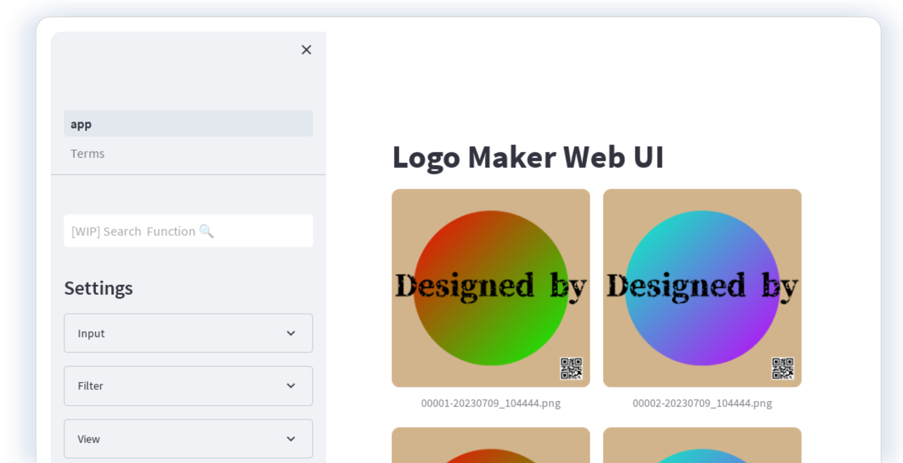

# Logomaker

Logomaker is an online tool that allows you to create your unique logos with mass product pattern.
You don't have to be a professional designer to craft beautiful logos with just a few clicks.

## Demo
Try the demo by accessing the following link:
[https://morisono-logomaker.hf.space](https://morisono-logomaker.hf.space)

## Features

- **Easy to Use**: Design intuitively with drag & drop functionality.
- **Customizable**: Choose freely from colors, fonts, icons, and more.
- **Free**: Logomaker is entirely free to use.

## How to Use

1. Visit the [demo page](https://morisono-logomaker.hf.space).
2. Customize your design from the left panel.
3. Click the 'Save' button to download your logo.

## License

This project is licensed under the MIT License. For more details, see the [LICENSE](LICENSE) file.
